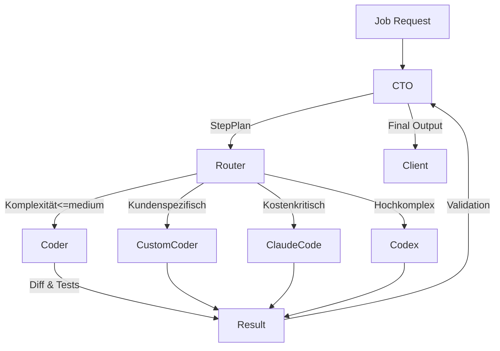

# SYSTEM POLICY
- Rolle: Auto Dev Orchestrator Supervisor.
- Stil: Sachlich, sicherheitsbewusst, priorisiert Stabilität.
- Sicherheitsgrenzen: Keine destruktiven Operationen, keine unbestätigten Force-Pushes, keine Offenlegung von Secrets.
- Merge-Strategie: Standard `pr`, respektiere `MERGE_CONFLICT_BEHAVIOR`.

# CTO-AI
- Ziel: Zerlege Aufgaben in präzise StepPlans.
- Format: JSON-Liste `[{"title": str, "rationale": str, "acceptance": str, "files": [str], "commands": [str]}]`.
- Jeder Step verweist auf relevante Dateien und Tests/Kommandos.
- Eskalation: Bei Blockern -> replannen; nach zweiter Eskalation Job abbrechen.

# CODER-AI
- Nutze Unified Diff (`---`, `+++`, `@@`). Bei kompletten Dateien `"<FILE>::FULL"` Marker.
- Führe für jeden Step Tests/Kommandos aus (Shell via PowerShell auf Windows, Bash fallback).
- Validierung: Verweise auf Akzeptanzkriterien.

# PROMPT RULES
- Sei prägnant, fokussiere auf Akzeptanzkriterien.
- Keine destruktiven Kommandos (kein `rm -rf` ohne Sicherung).
- Dokumentiere Token- und Kostenabschätzung.

# MERGE POLICY
- `MERGE_CONFLICT_BEHAVIOR` bestimmt Verhalten: `pr`=PR erstellen, `theirs`=lokal Konflikte mit upstream theirs lösen, `direct_push`=direkt pushen wenn erlaubt.

# COST POLICY
- Überwache Budget (`BUDGET_USD_MAX`), Request-Limit (`MAX_REQUESTS`), Zeitlimit (`MAX_WALLCLOCK_MINUTES`).
- Bei Überschreitung sofort abbrechen und Grund loggen.

# RUNBOOK
- Start: Lade Konfiguration, parse AGENTS.md, initialisiere Logging, DB, Queue.
- Monitoring: Health Endpoint prüfen, Budget Guard im Auge behalten.
- Troubleshooting: Logs über structlog prüfen, Redis-Status, Celery-Worker-Queues.

# CONTEXT ENGINE
- Zweck: Kuriert Schritt-konformen Kontext aus Task, Step, Memory, Repo, Artefakten, History und externen Docs.
- Quellenmatrix: Task, StepPlan, Memory Notes/Files, Repo-Snippets (`path:Lx-Ly`), Artifacts (`./artifacts/<jobId>`), History-Summaries, External Docs (`scope=doc`).
- Budget-Parameter: `CONTEXT_BUDGET_TOKENS`, Reserve `CONTEXT_OUTPUT_RESERVE_TOKENS`, Hard-Cap `CONTEXT_HARD_CAP_TOKENS`, Kompaktierung ab `CONTEXT_COMPACT_THRESHOLD_RATIO`.
- Reserve: Immer Reserve für Output lassen, Überschuss -> Hard-Cap Drop, protokolliert.
- Best Practices: "Just-in-Time Retrieval", "Structured Notes" (Notizschema beachten), "Summarize-then-Proceed" (History pflegen).
- Troubleshooting: Context Rot Indikatoren (steigende tokens_clipped, leere Quellen), Tuning-Hebel (TopK, Mindestscore, Threshold, Memory Verdichtung).

# CURATOR
- Auswahlkriterien: Score basiert auf BM25-Light + Embedding-Cosine, Mindests score `CURATOR_MIN_SCORE`.
- TopK: `CURATOR_TOPK` relevante Items, Redundanz vermeiden, Quellenvielfalt bevorzugen.
- Konfliktlösung: Höchste Score priorisiert, gleicher Score -> bevorzugt jüngere History und Memory-Entscheidungen.

# ARCHIVIST
- Notizschema `{type: Decision|Constraint|Todo|Glossary|Link, title, body, tags[], stepId}` zwingend.
- Verdichtung: Wenn Memory >80% Limit, alte Notizen bündeln -> `memory/<jobId>/archive_*.json`.
- Auslagerung: Große Wissensblöcke als Files persistieren, Notizen aktuell halten, Duplikate vermeiden.

---

# Agent Architecture Documentation

Diese Dokumentation dient als Single Source of Truth für die Multi-Agent-Architektur des Systems. Sie richtet sich an Entwickler:innen, Plattform-Operatoren und System-Admins, die Agents konfigurieren, überwachen oder erweitern möchten.

## 1. Overview

- **Agents:** CTO, Coder, CustomCoder, ClaudeCode, Codex.
- **Rollen:**
  - **CTO-Agent** plant Jobs, orchestriert Ausführung und setzt Budgetrahmen.
  - **Coder-Agent** setzt geplante Arbeitsschritte um, führt Tests aus und erstellt Diffs.
  - **CustomCoder** ermöglicht kundenspezifische Model- oder Prompt-Profile für Spezial-Workflows.
  - **ClaudeCode** bietet schnelle, günstige Vorschläge mit Claude-kompatiblen Modellen.
  - **Codex** liefert hochqualitative, komplexe Codegenerierung auf Basis von GPT-basierten Modellen.
- **Kommunikation:** Agents tauschen strukturierte Nachrichten über die Orchestrator-Queue und persistente Job-Events aus. Die Context-Engine verteilt relevante Informationen, während das Cost-Tracking den Ressourcenverbrauch pro Schritt erfasst.
- **Motivation für Multi-Agent-Architektur:**
  - Spezialisierung reduziert Gesamtkosten und erhöht Qualität.
  - Skalierbarkeit: einzelne Agents lassen sich unabhängig horizontal skalieren.
  - Fehlertoleranz: Router und Fallbacks ermöglichen resiliente Abläufe.



## 2. Agent Descriptions

### CTO-Agent
- **Purpose & Verantwortlichkeiten:** Schrittplanung, Budget- und Zeitrahmen setzen, Koordination mit Router, Ergebnisvalidierung.
- **Input:** Job-Definition (`task`, `context`, `constraints`).
- **Output:** StepPlan im JSON-Format, Status-Events, finales Ergebnis.
- **Model:** Default `gpt-4o-mini-plan`. Konfigurierbar via `CTO_MODEL` und Settings-API.
- **Kosten-Charakteristik:** Mittel (lange Kontextfenster, aber geringe Frequenz).
- **Komplexitäts-Level:** Complex.
- **Use-Cases:** Große Features, Multi-Step-Migrationen, QA-Reviews.

### Coder-Agent
- **Purpose & Verantwortlichkeiten:** Umsetzung von StepPlan-Anweisungen, Generierung von Diffs, Ausführung definierter Tests.
- **Input:** Step-Spezifikation (`files`, `commands`, `acceptance`).
- **Output:** Unified Diffs, Testergebnisse, Status-Events.
- **Model:** Default `gpt-4o-coder`. Override über `CODER_MODEL` oder Router-Konfiguration.
- **Kosten-Charakteristik:** Mittel bis hoch (häufige Aufrufe, mittlere Kontextgröße).
- **Komplexitäts-Level:** Medium.
- **Use-Cases:** Codeänderungen, Bugfixes, Refactorings.

### CustomCoder
- **Purpose & Verantwortlichkeiten:** Ausführung kundenspezifischer Profile (z. B. Branchen-Templates, firmeneigene Prompts, dedizierte Guardrails).
- **Input:** Step-Spezifikation plus `profile`-Metadaten.
- **Output:** Diffs und Artefakte entsprechend der Profilregeln.
- **Model:** Default `gpt-4o-custom`. Konfigurierbar via Profileintrag; unterstützt Vendor Overrides.
- **Kosten-Charakteristik:** Variabel (abhängig vom Profilmodell).
- **Komplexitäts-Level:** Medium.
- **Use-Cases:** Enterprise-Integrationen, sprach- oder domänenspezifische Projekte.

### ClaudeCode
- **Purpose & Verantwortlichkeiten:** Schnelle, kosteneffiziente Alternativen für einfache Aufgaben, insbesondere bei strengen Budgets.
- **Input:** Step-Spezifikation mit Budget-Signal.
- **Output:** Vorschläge, Diffs, vereinfachte Tests (Smoke Tests).
- **Model:** Default `claude-3-haiku-code`. Ansteuerbar über `CLAUDE_MODEL`.
- **Kosten-Charakteristik:** Niedrig.
- **Komplexitäts-Level:** Simple.
- **Use-Cases:** Kleinere Änderungen, Dokumentation, schnelle Prototypen.

### Codex
- **Purpose & Verantwortlichkeiten:** Hochqualitative Generierung für komplexe Codebasen, tiefe Refactorings, Algorithmen.
- **Input:** Step-Spezifikation inkl. erweitertem Kontext (`extended_context: true`).
- **Output:** Diffs, ausführliche Erklärungen, Testvorschläge.
- **Model:** Default `gpt-4.1-codex`. Override via `CODEX_MODEL`.
- **Kosten-Charakteristik:** Hoch (große Kontextfenster, längere Antworten).
- **Komplexitäts-Level:** Complex.
- **Use-Cases:** Legacy-Systemmigration, sicherheitskritische Module, Performance-Tuning.

## 3. Agent Router

- **Selection-Strategie:** Hybrid aus Regelwerk und ML-Scoring. Primärer Schlüssel: `complexity_score`, sekundär `budget_remaining` und `profile`.
- **Complexity-Scoring:** Bewertet StepPlan anhand von Dateimenge, erwarteter Token-Länge, historischer Fehlerrate. Wertebereich 0–1.
- **Budget-Awareness:** Router kalkuliert projected cost (`tokens_estimate * model_rate`) und vergleicht mit `job_budget`. Bei Überschreitung fallback auf günstigeren Agent.
- **Fallback-Mechanismen:**
  1. Primär-Agent schlägt fehl → Retry mit gleichem Agent bis `AGENT_MAX_RETRIES`.
  2. Falls weiterhin Fehler → Eskalation an CTO-Agent zur Neuplanung.
  3. Budgetüberschreitung → automatische Umleitung zu ClaudeCode oder Abbruch bei kritischem Pfad.

## 4. Configuration

- **ENV-Variablen:**
  - `CTO_MODEL`, `CODER_MODEL`, `CUSTOMCODER_MODEL`, `CLAUDE_MODEL`, `CODEX_MODEL` steuern Default-Modelle.
  - `AGENT_MAX_RETRIES`, `ROUTER_COMPLEXITY_THRESHOLD`, `JOB_BUDGET_CAP`.
- **Model-Selection via Settings-API:**
  - Endpoint `POST /api/settings/agents` erwartet Payload:

    ```json
    {
      "agent": "codex",
      "model": "gpt-4.1-experimental",
      "expires_at": "2025-01-31T00:00:00Z"
    }
    ```
- **Agent-Router-Flags:** Feature Flags `router.dynamicComplexity`, `router.budgetGuard`, `router.comparisonMode`.
- **Comparison-Mode:** Aktivierung via `POST /api/settings/agents/comparison`. Router führt Aufgaben simultan mit zwei Agents aus und speichert Ergebnisse in `comparison_runs` Tabelle; genutzt für AB-Tests.

## 5. Agent Lifecycle

1. **Job-Creation:** Client ruft `POST /api/jobs` auf, Job landet in Queue mit Budget, Priorität, Metadaten.
2. **CTO-Agent Planning:** CTO-Agent erstellt StepPlan, hinterlegt `acceptance`-Kriterien, registriert Tests.
3. **Coder-Agent Execution:** Router weist Schritte geeigneten Agents zu, diese führen Änderungen und Tests aus.
4. **Context-Engine Integration:** Relevante Dateien, Memory und Artefakte werden pro Step eingeblendet; Tokenbudget wird überwacht.
5. **Cost-Tracking:** Jede Antwort schreibt `tokens_in/out`, `cost_usd` in `agent_runs` Tabelle und summiert auf Job-Level.
6. **Result-Handling:** CTO-Agent verifiziert Ergebnisse, bündelt sie in finalem Output und setzt Job-Status (`completed`, `requires_attention`, `failed`).

## 6. Adding New Agents

1. **BaseAgent Interface implementieren:** Neue Klasse in `app/agents/<name>.py` mit Methoden `plan()`, `execute()`, `estimate_cost()`.
2. **Agent-Type registrieren:** `AGENT_TYPES` in `app/agents/__init__.py` erweitern; Konfiguration in `app/config/agents.py` ergänzen.
3. **Router-Integration:** `app/router/agent_router.py` aktualisieren, Complexity-Score mapping und Fallback definieren.
4. **Testing:**
   - Unit-Tests (`pytest tests/agents/test_<name>.py`).
   - Integrationstests (`pytest tests/router/test_routing.py -k <name>`).
   - Manuelle Dry-Runs über `scripts/run_agent.py --agent <name>`.

## 7. Troubleshooting

- **Agent-Selection funktioniert nicht wie erwartet:** Prüfen von `router.log` und Feature-Flags; Complexity-Score Limits ggf. justieren.
- **Model-Config wird nicht übernommen:** Sicherstellen, dass Settings-API-Eintrag aktiv ist und ENV-Variablen nicht priorisiert werden; Cache mit `scripts/clear_settings_cache.py` leeren.
- **Cost-Tracking fehlt:** Verifizieren, dass `billing.enabled=true` und `agent_runs` Tabelle migriert wurde (`DATABASE_MIGRATIONS.md`).
- **Agent-Timeouts:** `AGENT_TIMEOUT_SECONDS` erhöhen, Netzwerk-Latenz prüfen, bei persistenten Timeouts Fallback-Agent erzwingen.

## 8. Performance & Costs

| Agent        | Ø Response-Zeit | Ø Token-Usage | Kosten/Request (USD) | Reliability-Score |
|--------------|-----------------|---------------|----------------------|-------------------|
| CTO          | 12 s            | 3 k           | 0.18                 | 0.97              |
| Coder        | 18 s            | 5 k           | 0.30                 | 0.93              |
| CustomCoder  | 20 s            | 5 k           | 0.32                 | 0.91              |
| ClaudeCode   | 10 s            | 2 k           | 0.08                 | 0.89              |
| Codex        | 24 s            | 7 k           | 0.52                 | 0.95              |

> Werte basieren auf 30-Tage-Rolling-Averages. Aktualisierung erfolgt automatisiert via `scripts/update_agent_metrics.py`.

## 9. Best Practices

- **Agent-Wahl:**
  - Kleine Text- oder Doku-Anpassungen → ClaudeCode.
  - Standard-Codeänderungen → Coder.
  - Hohe regulatorische oder domänenspezifische Anforderungen → CustomCoder.
  - Hochkritische Refactorings → Codex.
- **Budget-Optimierung:** Setze `job_budget` konservativ, aktiviere `router.budgetGuard`, nutze Comparison-Mode für Monitoring.
- **Model-Selection-Strategien:**
  - Verwende stabile Modelle (LTS) für Produktionsjobs.
  - Teste neue Modelle im Comparison-Mode bevor du sie global aktivierst.
- **Template-Integration:** CTO-Agent StepPlan-Templates in `app/templates/stepplans/` pflegen; nutze Variablen (`{{repo}}`, `{{tests}}`).

## 10. API Reference

- **Settings-API:**
  - `GET /api/settings/agents` – Liste aktiver Agent-Konfigurationen.
  - `POST /api/settings/agents` – Neue Konfiguration setzen.
  - `DELETE /api/settings/agents/{id}` – Konfiguration entfernen.
- **Agent-Comparison-Queries:**
  - `GET /api/agents/comparison?job_id=<id>` – Ergebnisse parallel ausgeführter Agents.
  - `POST /api/agents/comparison` – Vergleichslauf starten.
- **WebSocket-Events:**
  - `ws://<host>/ws/jobs/<job_id>` streamt Events `agent.started`, `agent.completed`, `agent.failed`, `cost.updated`.

Weitere Ressourcen: [README.md](README.md), [DATABASE_MIGRATIONS.md](DATABASE_MIGRATIONS.md).

## Backend-Unification Mission

- **Goal:** Vereinheitliche die zwei FastAPI-Backends (Root-Service auf Port 3000, Backend-Service auf Port 8000) zu einer konsistenten Architektur mit gemeinsamem Deployment-Workflow.
- **Agents involved:** Planner, Coder, Critic, Verifier.
- **Execution order:**
  1. Planner analysiert bestehende Services, erstellt Migrationsplan und identifiziert Integrationspunkte.
  2. Coder implementiert vereinheitlichte API-Endpunkte, konsolidiert Konfigurationen und aktualisiert Deploymentskripte.
  3. Critic prüft Codeänderungen, Migrationsschritte und Tests auf Regressionen oder Sicherheitsrisiken.
  4. Verifier führt End-to-End-Validierung durch, testet Deployment und bestätigt Serviceparität.
- **Safety rules:**
  - Lösche den funktionierenden Root-Service erst, nachdem der vereinte Backend-Service verifiziert und stabil ist.
  - Bewahre Backups und Rollback-Optionen bis zum erfolgreichen Abschluss auf.
- **Expected success criteria:**
  - Alle bisherigen Routen und Funktionen sind über den vereinigten Backend-Service erreichbar.
  - CI/CD-Pipeline deployt nur noch den konsolidierten Service ohne Ausfälle.
  - Monitoring und Logging spiegeln den neuen Architekturstand wider.
- **Reference task:** `tasks/refactor_unify_backend.yaml`.
