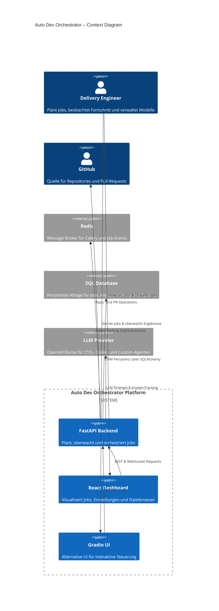
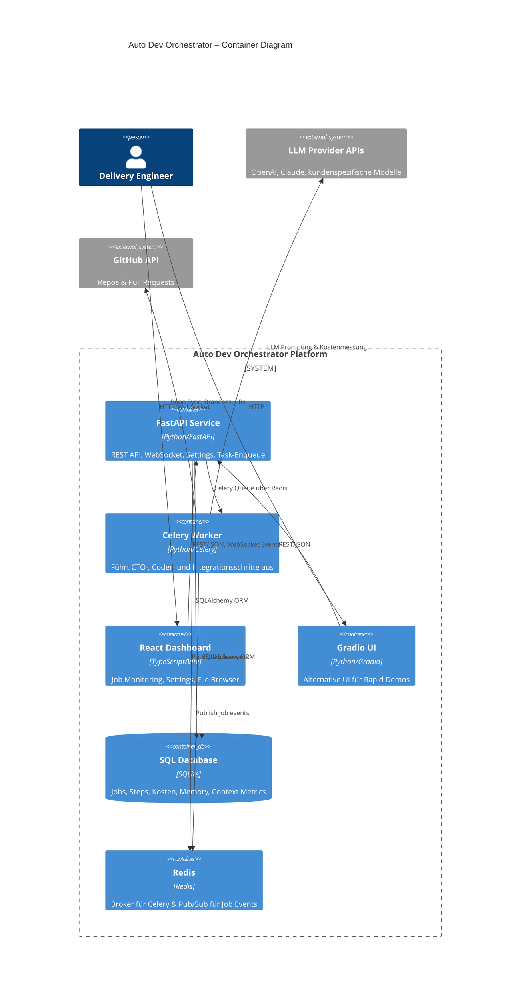

# System Overview

## Context Diagram (C4 Level 1)

## Container Diagram (C4 Level 2)

## Architektur-Hauptpunkte

- **Domänenorientierung:** Die Plattform folgt einem Domain-Driven-Design-Ansatz mit Kernfokus auf der *Orchestration*-Domäne. Erweiterbare Domänen für Authentifizierung und Billing sind bereits vorgesehen.
- **Multi-Agent-Orchestrierung:** Die CTO-, Coder-, CustomCoder-, ClaudeCode- und Codex-Agenten koordinieren sich über den Agent Router. Informationen zur Agentenlandschaft stammen aus `AGENTS.md` und werden beim Start eingelesen.
- **Event-getriebene Transparenz:** Jobstatus und Kostenupdates werden über Redis Pub/Sub verteilt und über WebSockets in Frontends angezeigt.
- **Konfigurierbarkeit & Guardrails:** Settings-API und Environment-Management stellen sicher, dass Model- und Budgetgrenzen dynamisch angepasst werden können. Budget Guards sind zentral im Healthcheck einsehbar.

## Laufzeitfluss (High-Level)

1. **Task-Anlage:** Ein:e Engineer:in oder die UI erstellt über `/tasks` einen neuen Job. Der Backend-Service persistiert den Job, legt Budgetlimits fest und übergibt die Arbeit an den Celery-Worker.
2. **Planning:** Der CTO-Agent erzeugt Step-Pläne, wobei `AGENTS.md` als Policies dient. Ergebnisse werden in der Datenbank gespeichert.
3. **Execution:** Der Agent Router weist Schritte geeigneten Agents zu. Der Coder-Agent erstellt Diffs, führt Tests aus und aktualisiert Jobkosten.
4. **Events & Monitoring:** Fortschritt, Kosten und Kontextmetriken werden kontinuierlich in der Datenbank protokolliert und über Redis `job-events` an verbundene Clients gestreamt.
5. **Completion:** Sobald alle Steps abgeschlossen sind, aktualisiert das System den Jobstatus, erstellt optional Pull Requests und signalisiert Abschlussereignisse.

## Nicht-funktionale Anforderungen

- **Stabilität:** Start-up Hooks bauen Datenbankschemata automatisch auf und verhindern fehlende Agentenspezifikationen.
- **Transparenz:** Kosten-Tracking pro Agent und Rolling-Averages für Performance (siehe `AGENTS.md`).
- **Skalierbarkeit:** API- und Worker-Container können unabhängig horizontal skaliert werden; Redis dient als shared broker.
- **Compliance & Sicherheit:** Secrets werden über Settings-API verwaltet, Dateibrowser hat Pfad-Sandboxing und Memory Store erzwingt Limits.

## Schnittstellen

- **REST API:** Siehe `docs/integration/API_CONTRACTS.yaml` für formale Contracts.
- **WebSocket:** Echtzeit-Events unter `ws://<host>/ws/jobs`.
- **Dateisystem:** Sandbox unter `./data` für temporäre Artefakte.

## Offene Fragen & Erweiterungen

- **Auth-System:** Zukünftige Integration eines dedizierten AuthN/AuthZ-Services (siehe Domain-Placeholder & Playbook).
- **Billing-Integration:** Erweiterung der Kostenmodelle um provider-spezifische Abrechnung und Export nach externen Systemen.
- **Model Governance:** Ausbau der Settings-API um Modellparameter, Rate Limits und Audit Trails.
