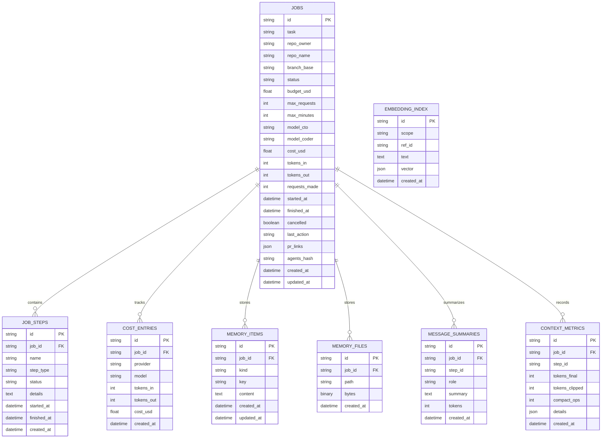

# Database Schema

Die Plattform nutzt SQLAlchemy mit SQLite (Standard) bzw. kompatiblen RDBMS. Das Schema wird bei Start von `app.main` automatisch erzeugt.

## Table Details

### jobs
- Persistiert Job-Metadaten und Budgetgrenzen (Quelle: `app/db/models.py`).
- `agents_hash` verknüpft Jobs mit der verwendeten `AGENTS.md`-Version.
- `pr_links` enthält generierte Pull-Request-URLs.

### job_steps
- Speichert die Einzelschritte eines Jobs und deren Status (`planned`, `running`, `completed`, etc.).
- Dient als Grundlage für Fortschrittsberechnung und Event-Emission.

### cost_entries
- Trackt Token- und Kostenwerte pro Agent-Aufruf.
- Grundlage für spätere Billing-Aggregationen.

### memory_items
- JSON-basierte Notizen (`notes`) für Structured Memory.
- Unterstützt Guardrails via `MemoryStore` (Limits, Tags).

### memory_files
- Binäre Artefakte, die Uploads aus `/memory/{job_id}/files` ablegen.
- Pfade referenzieren Sandbox-Verzeichnis `./data`.

### message_summaries
- Persistiert agentenseitige Nachrichten-Zusammenfassungen für Auditing.

### embedding_index
- Speichert Embeddings für Kontextdokumente (Scope `doc`, `memory`, ...).
- Interagiert mit `EmbeddingStore` und OpenAI-Provider.

### context_metrics
- Bewahrt Kontextdiagnosen (Tokens, Kompressionsoperationen) für die UI.
